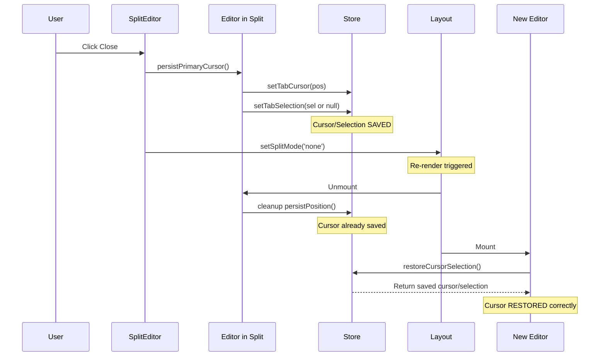
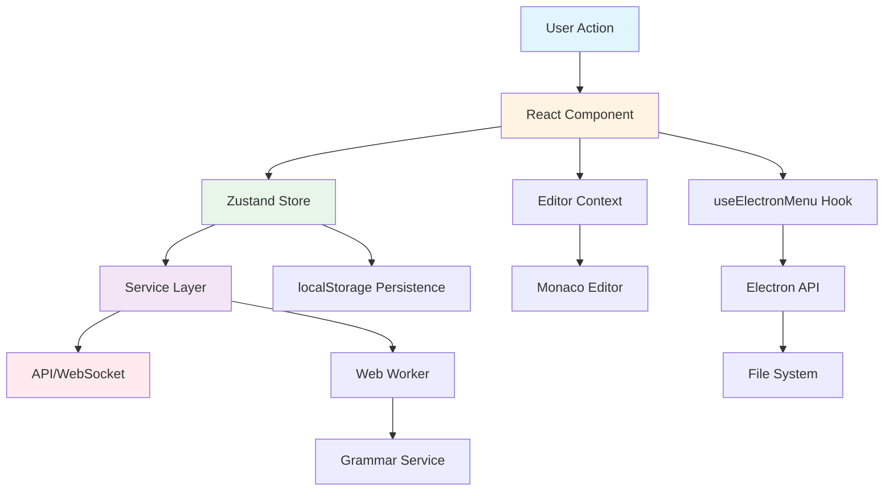
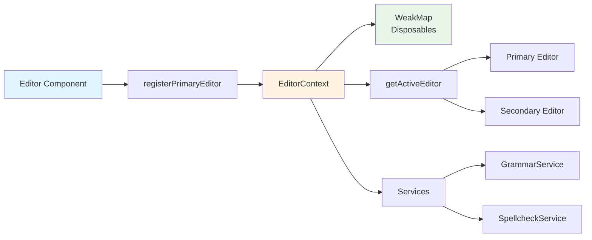
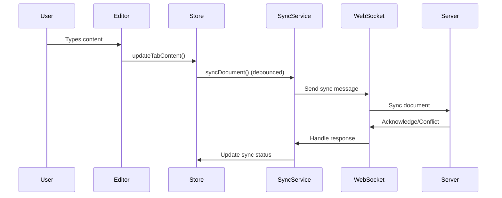
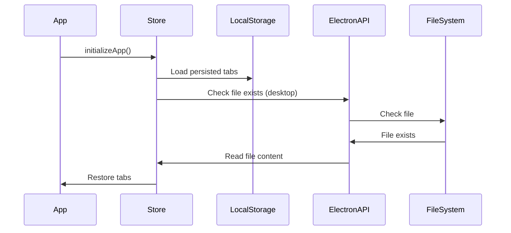
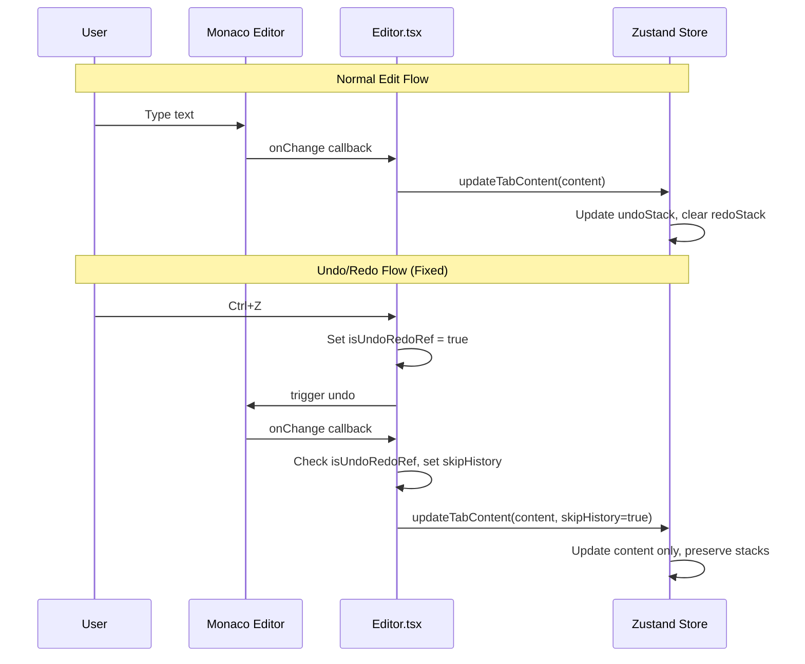

# md-crafter Architecture Documentation

## Overview

md-crafter is a monorepo-based cloud-synced markdown editor built with React, TypeScript, Electron, and Node.js. The application consists of four main packages: `shared`, `server`, `web`, and `desktop`.

## Monorepo Structure

```
md-crafter/
├── packages/
│   ├── shared/          # Shared types, utilities, and business logic
│   ├── server/          # Backend API server (Express + Socket.IO)
│   ├── web/             # Web application (React + Vite)
│   └── desktop/         # Desktop application (Electron)
├── e2e/                 # End-to-end tests (Playwright)
└── docs/                # Documentation
```

### Package Responsibilities

- **shared**: Common types (`Document`, `User`, `SyncStatus`), utilities (debounce, hash, diff, word count), and sync logic (`SyncManager`, `ConflictResolver`)
- **server**: REST API for document CRUD, authentication, settings, and Socket.IO server for real-time collaboration
- **web**: React-based web application with Monaco Editor, Zustand state management, and cloud sync
- **desktop**: Electron wrapper around web package with native file system access and menus

## State Management Architecture

### Zustand Store Structure

The application uses Zustand for state management with a slice-based architecture:

```
AppState (useStore)
├── TabsSlice          # Document tabs and active tab management
├── UISlice            # UI state (theme, modals, split mode, diff mode)
├── ToastsSlice        # Toast notifications
├── DocumentsSlice     # Cloud documents and recent files
├── AuthSlice          # Authentication state and operations
├── SyncSlice          # Sync state and debounced sync operations
├── SettingsSlice      # User settings (font, theme, sync interval)
└── Additional Actions # initializeApp, clipboard, import, format, grammar
```

### State Persistence

- **Persisted to localStorage**: `apiToken`, `theme`, `settings`, `sidebarWidth`, `recentFiles`, `tabs`, `activeTabId`
- **Not persisted**: UI modals, toasts, online status, conflicts (ephemeral state)

### Data Flow

```
User Action
    ↓
Component (MenuBar, Editor, etc.)
    ↓
useStore().action()
    ↓
Zustand Store (slice)
    ↓
Service Layer (api, sync, clipboard, etc.)
    ↓
API/WebSocket/File System
```

## Component Hierarchy

```
App
├── ErrorBoundary
│   └── EditorContextProvider
│       └── Layout
│           ├── MenuBar (web only)
│           ├── Sidebar
│           ├── TabBar
│           ├── Editor / SplitEditor
│           │   └── Monaco Editor
│           ├── MarkdownPreview / MDXPreview
│           └── StatusBar
├── Modals (lazy-loaded)
│   ├── CommandPalette
│   ├── SettingsModal
│   ├── AuthModal
│   ├── ConflictModal
│   └── ... (other modals)
└── Toast
```

## Editor Context Architecture

### Overview

The `EditorContext` is a React Context that centralizes the management of Monaco editor instances and related services across the application. This replaces the previous pattern of storing editor instances on the global `window` object, which made unit testing difficult and created architectural anti-patterns.

### Why Editor Context?

**Previous Pattern (Anti-pattern):**
- Editor instances stored on `window.monacoEditor`, `window.monaco`, `window.grammarService`
- Direct global access throughout the application
- Difficult to test (required mocking global objects)
- No type safety for editor access
- Hard to track which editor is active

**Current Pattern (Editor Context):**
- Centralized state management via React Context
- Type-safe access via `useEditorContext()` hook
- Easy to test (mock context provider)
- Tracks active editor (primary, secondary, or diff)
- Supports multiple editor instances (split view, diff view)

### Context Structure

```typescript
interface EditorContextValue {
  // Editor instances
  primaryEditor: monaco.editor.IStandaloneCodeEditor | null;
  primaryMonaco: typeof monaco | null;
  secondaryEditor: monaco.editor.IStandaloneCodeEditor | null;
  secondaryMonaco: typeof monaco | null;
  diffEditor: monaco.editor.IDiffEditor | null;
  diffMonaco: typeof monaco | null;
  
  // Services
  grammarService: GrammarService | null;
  spellcheckService: SpellcheckService | null;
  
  // Registration functions
  registerPrimaryEditor: (editor, monaco) => void;
  registerSecondaryEditor: (editor, monaco) => void;
  registerDiffEditor: (editor, monaco) => void;
  unregisterPrimaryEditor: () => void;
  unregisterSecondaryEditor: () => void;
  unregisterDiffEditor: () => void;
  registerGrammarService: (service) => void;
  registerSpellcheckService: (service) => void;
  unregisterGrammarService: () => void;
  unregisterSpellcheckService: () => void;
  
  // Utility
  getActiveEditor: () => monaco.editor.IStandaloneCodeEditor | null;
  
  // Monaco model management (per-tab models for undo/redo persistence)
  getOrCreateModel: (tab: Tab, monacoInstance?: typeof monaco | null) => monaco.editor.ITextModel | null;
  disposeModel: (tabId: string) => void;
}
```

### Usage Pattern

**In Components:**
```typescript
import { useEditorContext } from '../contexts/EditorContext';

function MyComponent() {
  const { primaryEditor, getActiveEditor } = useEditorContext();
  const activeEditor = getActiveEditor();
  // Use activeEditor...
}
```

**In Editor Components:**
```typescript
function Editor() {
  const { registerPrimaryEditor, unregisterPrimaryEditor } = useEditorContext();
  
  const handleMount = (editor, monaco) => {
    registerPrimaryEditor(editor, monaco);
  };
  
  useEffect(() => {
    return () => {
      unregisterPrimaryEditor();
    };
  }, []);
  
  return <MonacoEditor onMount={handleMount} />;
}
```

**In Store Actions:**
```typescript
// Actions now accept editor instances as parameters instead of accessing window
function checkGrammar(options?: { editor?, monaco?, grammarService? }) {
  const editor = options?.editor || getActiveEditor();
  // Use editor...
}
```

### Active Editor Tracking

The context tracks which editor is currently focused:
- **Primary Editor**: Main editor instance (default)
- **Secondary Editor**: Split view secondary pane
- **Diff Editor**: Diff view mode

The `getActiveEditor()` function returns the currently focused editor based on focus events tracked via `onDidFocusEditorText()`.

### Status Bar Editor Selection Tracking

The `useEditorSelection` hook tracks cursor position and selection for the status bar. It uses different editors based on the current view mode:

- **Normal/Split Mode**: Always uses `primaryEditor` (never falls back to `getActiveEditor()` which might return the secondary editor)
- **Diff Mode**: Uses the **modified (right) editor** which represents the current document being edited
  - Falls back to original editor only if modified editor is unavailable
  - Diff mode takes precedence over regular editor mode

**Key Design Decision:** The status bar should ALWAYS show stats from the primary/active document, not the focused editor. In split view, clicking on the secondary pane should NOT change the status bar display.

**Implementation:**
```typescript
const { primaryEditor, diffEditor } = useEditorContext();

const getCurrentEditor = (): EditorLike | null => {
  if (diffEditor) {
    // Diff mode: prefer modified (right) editor, fallback to original
    const modifiedEditor = diffEditor.getModifiedEditor();
    if (modifiedEditor) return modifiedEditor;
    return diffEditor.getOriginalEditor();
  }
  // Normal/split mode: always use primaryEditor
  // Do NOT fall back to getActiveEditor() - it might return secondary editor
  return primaryEditor;
};
```

### Split Editor Primary Locking

When split view is activated, the primary pane is **locked** to the document that initiated split mode:

- **Primary Tab Locked**: The tab that was active when split mode was enabled remains the primary document (tracked via `lockedPrimaryTabIdRef`)
- **Secondary Tab Selectable**: Only the secondary pane can be changed via dropdown
- **Primary Excluded from Secondary**: The locked primary tab is excluded from the secondary dropdown options to prevent duplicate views

**Split State Management:**
- `splitSecondaryTabId`: Stored per-tab to track which document is shown in secondary pane
- `setTabSplitState(tabId, { secondaryTabId, ratio })`: Updates split configuration for a tab
- `splitPaneRatio`: Persisted ratio for the split divider position (0.2 to 0.8)

**Cursor Persistence on Split Exit:**
- `persistPrimaryCursor()` in `SplitEditor.tsx` saves cursor/selection BEFORE closing split mode
- Called synchronously in close button handler before `setSplitMode('none')`
- Prevents cursor loss that would occur if relying only on unmount cleanup

**Cursor/Selection Persistence Across View Modes:**

Cursor position and selection are persisted when transitioning between view modes (normal, split, diff).

**Architecture:**
- **Mode Entry**: `Layout.tsx` persists cursor/selection from `primaryEditor` when entering split/diff mode
- **Mode Exit**: Component cleanup effects handle persistence (Editor's unmount effect calls `persistPosition`)
- **Diff View**: Uses standard cursor persistence (no special handling)

**Key Design Decision:** Layout.tsx only persists on mode ENTRY, not exit. This is because React's `useEffect` runs AFTER render, meaning on mode exit the effect would persist from the NEW editor (at position 1,1), overwriting the correctly-persisted cursor from the unmounting component's cleanup.

**Mode Entry (entering split/diff mode):**
1. `Layout.tsx` detects mode change via refs (`prevSplitModeRef`, `prevDiffModeRef`)
2. `Layout.tsx` persists cursor/selection from `primaryEditor` to store
3. React switches conditional rendering to the new view component

**Mode Exit (returning to normal mode):**
1. Close button handler in `SplitEditor.tsx` calls `persistPrimaryCursor()` BEFORE `setSplitMode('none')`
2. `Editor.tsx` cleanup effect also calls `persistPosition()` on unmount
3. `Editor.tsx` resets `lastAppliedTabIdRef` when mode becomes normal, forcing cursor restoration

**Selection Handling:**
- Selection is stored separately from cursor position
- Collapsed selections (cursor with no selected text) are cleared - only cursor position is stored
- Non-collapsed selections (actual selected text) are stored and restored

```typescript
// In persistPosition - selection is only stored if NOT collapsed
const isCollapsed = selection && 
  selection.startLineNumber === selection.endLineNumber && 
  selection.startColumn === selection.endColumn;
const nextSelection = (selection && !isCollapsed) ? { /* selection data */ } : null;
```

**The `autoFocus` Prop:**
The `Editor` component accepts an `autoFocus` prop that defaults based on `registerAs`:
- `primary` editors auto-focus (default `autoFocus={true}`)
- `secondary` editors do not auto-focus (default `autoFocus={false}`)

This prevents the secondary editor from stealing focus when split view opens.

**Cursor Restoration:**
- `Editor.tsx` `restoreCursorSelection` restores selection first (if present), then falls back to cursor
- Multiple apply attempts (direct, RAF, setTimeout) ensure Monaco has processed the position
- `autoFocus` controls whether editor receives focus after restoration

**Data Flow (Split View Exit):**


### Diff Editor Word Wrap Retry Mechanism

Diff editors use a retry mechanism to apply word wrap settings when models may not be ready immediately:

- **Retry Limit**: Maximum 50 retries (`MAX_RETRIES = 50`)
- **Retry Method**: Uses `requestAnimationFrame` to retry until models are ready
- **Graceful Failure**: Silently stops retrying after max retries (models may not be ready yet)

**Implementation:**
```typescript
const applyWordWrap = (retryCount = 0) => {
  const MAX_RETRIES = 50;
  const originalEditor = diffEditor.getOriginalEditor();
  const modifiedEditor = diffEditor.getModifiedEditor();
  const originalModel = originalEditor?.getModel();
  const modifiedModel = modifiedEditor?.getModel();
  
  if (originalEditor && modifiedEditor && originalModel && modifiedModel) {
    // Apply word wrap to both editors
    originalEditor.updateOptions({ wordWrap: settings.wordWrap ? 'on' : 'off' });
    modifiedEditor.updateOptions({ wordWrap: settings.wordWrap ? 'on' : 'off' });
  } else if (retryCount < MAX_RETRIES) {
    requestAnimationFrame(() => applyWordWrap(retryCount + 1));
  }
  // Silently fail if max retries reached
};
```

**Why Retry?**
- Monaco diff editor models may not be immediately available when the component mounts
- `requestAnimationFrame` ensures we retry after the browser has had a chance to initialize the models
- Retry limit prevents infinite loops if models never become ready

### Disposable Cleanup with WeakMap

Editor disposables (focus tracking listeners) are stored using a `WeakMap` for type-safe cleanup:

```typescript
// Module-level WeakMap for type-safe disposable tracking
const editorDisposables = new WeakMap<
  monaco.editor.IStandaloneCodeEditor,
  monaco.IDisposable
>();

// When registering an editor
const disposable = editor.onDidFocusEditorText(() => {
  focusedEditorRef.current = 'primary';
});
editorDisposables.set(editor, disposable);

// When unregistering
const disposable = editorDisposables.get(editor);
disposable?.dispose();
editorDisposables.delete(editor);
```

**Why WeakMap?**
- **Type Safety**: Avoids `(editor as any)` type casts
- **Memory Safety**: WeakMap allows garbage collection when editor instances are no longer referenced
- **Clean Separation**: Disposables are tracked externally without modifying editor instances

### Testing with Editor Context

Tests use `MockEditorContextProvider` to provide controlled mock editor instances:

```typescript
import { MockEditorContextProvider, createMockEditor, createMockMonaco } from '../__tests__/mocks/editor-context';

test('component uses editor', () => {
  const mockEditor = createMockEditor();
  const mockMonaco = createMockMonaco();
  
  render(
    <MockEditorContextProvider primaryEditor={mockEditor} primaryMonaco={mockMonaco}>
      <MyComponent />
    </MockEditorContextProvider>
  );
});
```

### Migration from Global Window Pattern

Components that previously accessed `window.monacoEditor` now:
1. Use `useEditorContext()` hook
2. Call `getActiveEditor()` to get the current editor
3. Pass editor instances as parameters to store actions

This change improves:
- **Testability**: Easy to mock context in tests
- **Type Safety**: TypeScript ensures correct editor types
- **Architecture**: Follows React patterns instead of global state
- **Maintainability**: Clear data flow and dependencies

## Migrating Components to Editor Context

If you encounter code that still uses the old global window pattern, follow these steps:

### Step 1: Identify Global Access

Look for patterns like:
```typescript
// ❌ Old pattern
const editor = (window as any).monacoEditor;
const monaco = (window as any).monaco;
const grammarService = (window as any).grammarService;
```

### Step 2: Replace with Context Hook

```typescript
// ✅ New pattern
import { useEditorContext } from '../contexts/EditorContext';

function MyComponent() {
  const { getActiveEditor, primaryMonaco, grammarService } = useEditorContext();
  const editor = getActiveEditor();
  // Use editor...
}
```

### Step 3: Update Store Actions

If store actions need editor instances, pass them as parameters:

```typescript
// ❌ Old pattern
function checkGrammar() {
  const editor = (window as any).monacoEditor;
  // Use editor...
}

// ✅ New pattern
function checkGrammar(options?: { editor?, monaco?, grammarService? }) {
  const editor = options?.editor || getActiveEditor();
  // Use editor...
}
```

### Step 4: Update Tests

Wrap components with `MockEditorContextProvider`:

```typescript
import { MockEditorContextProvider, createMockEditor, createMockMonaco } from '../__tests__/mocks/editor-context';

test('component works', () => {
  const mockEditor = createMockEditor();
  const mockMonaco = createMockMonaco();
  
  render(
    <MockEditorContextProvider primaryEditor={mockEditor} primaryMonaco={mockMonaco}>
      <MyComponent />
    </MockEditorContextProvider>
  );
});
```

### Common Migration Scenarios

**Scenario 1: Component needs active editor**
- Use `getActiveEditor()` from context
- No need to track focus manually

**Scenario 2: Store action needs editor**
- Accept editor as optional parameter
- Fall back to `getActiveEditor()` if not provided

**Scenario 3: Service initialization**
- Register services via context (`registerGrammarService`, etc.)
- Access via context in components

## Error Handling Architecture

### Error Boundaries

The application uses React Error Boundaries to catch and handle component errors gracefully:

- **ErrorBoundary Component** (`components/ErrorBoundary.tsx`): Wraps the entire app, catches React errors and displays a user-friendly error message
- **Error Recovery**: Users can reload the app or report the error
- **Error Logging**: Errors are logged with context (component stack, error details) using `@md-crafter/shared/logger`

### Service Layer Error Handling

Services use consistent error handling patterns:

1. **API Errors** (`services/api.ts`): Handles HTTP errors, network failures, and authentication errors
   - Network errors: Shows toast notification
   - Authentication errors: Redirects to auth modal
   - Server errors: Logs and shows user-friendly message

2. **Sync Errors** (`services/sync.ts`): Handles Socket.IO errors, conflict detection, and sync failures
   - Socket.IO disconnection: Shows status in status bar
   - Conflict detection: Opens conflict resolution modal
   - Sync failures: Logs error and retries automatically

3. **Grammar/Spellcheck Errors**: Services log errors and show user-friendly toasts
   - Initialization failures: Gracefully degrade (disable feature)
   - Runtime errors: Log and continue operation

### User-Facing Error Messages

- **Toasts**: Non-critical errors shown as toast notifications (e.g., "Failed to save document")
  - Uses `useStore().addToast()` for consistent UI
  - Auto-dismisses after timeout
  - Supports different types: `info`, `success`, `warning`, `error`

- **Modals**: Critical errors shown in modals (e.g., conflict resolution)
  - Blocks user interaction until resolved
  - Provides clear action options
  - Examples: ConflictModal, AuthModal

- **Status Bar**: Connection status and sync errors displayed in status bar
  - Shows online/offline status
  - Displays sync status (syncing, pending, conflict, offline)
  - Non-intrusive, always visible

- **Inline Errors**: Component-specific errors shown inline (e.g., MDX compilation errors)
  - MDXPreview shows compilation errors in a styled error box
  - MarkdownPreview shows parse errors
  - Editor shows validation errors

### Error Logging

- Uses `@md-crafter/shared/logger` for consistent logging
- Errors logged with context (component, action, error details)
- Production: Errors logged to console (can be extended to error reporting service)
- Development: Full stack traces and detailed error information

### Error Recovery Strategies

1. **Automatic Retry**: Network requests and sync operations retry automatically
2. **Graceful Degradation**: Features disable gracefully if initialization fails (e.g., spellcheck)
3. **State Recovery**: App state persists to localStorage, allowing recovery on reload
4. **User Actions**: Users can manually retry failed operations (refresh, reload)

## Service Layer

### API Service (`services/api.ts`)
- REST API client for document CRUD operations
- Token-based authentication
- Error handling and retry logic

### Sync Service (`services/sync.ts`)
- Socket.IO connection management
- Real-time document synchronization
- Conflict detection and resolution
- Document subscription management

### Clipboard Service (`services/clipboard.ts`)
- Rich text to markdown conversion
- Word/Docs compatibility (HTML clipboard format)
- Fallback handling for browser compatibility

### Grammar Service (`services/grammar.ts`)
- Textlint integration via dedicated web worker (`workers/textlint.worker.ts`)
- Runs in background thread to avoid blocking UI
- Monaco marker creation for grammar issues
- Code action provider for fixes
- Uses `vitePluginTextlint()` for browser bundling with Node.js polyfills

### Spellcheck Service (`services/spellcheck.ts`)
- Monaco spellchecker integration using nspell (Hunspell-compatible)
- Dictionary management via DictionaryService (localStorage-based)
- Supplementary dictionaries from CSpell packages (12 dictionary sources)
- Custom dictionary and ignore list with hover suggestions

## Desktop App Architecture

### Electron Process Structure

```
Main Process (main/index.ts)
├── Window Management
├── Native Menu Creation
├── File System Operations
│   ├── File watching (fs.watch)
│   ├── Read/Write operations
│   └── Dialog operations
└── IPC Handlers

Preload Script (preload/index.ts)
├── Context Bridge Setup
└── API Exposure to Renderer

Renderer Process (web package)
└── React Application
```

### IPC Communication

- **Main → Renderer**: File opened events, external file changes, menu actions
- **Renderer → Main**: File operations (read, write, save as), dialog requests

### Electron Menu Integration

Electron menu handlers are set up via the `useElectronMenu` hook (`packages/web/src/hooks/useElectronMenu.ts`):

**Hook Responsibilities:**
- Registers all Electron menu event listeners
- Handles file operations (open, save, save as, close)
- Handles view operations (toggle sidebar, preview, command palette, etc.)
- Handles export/import operations
- Manages cleanup on unmount

**Usage:**
```typescript
import { useElectronMenu } from './hooks/useElectronMenu';

function AppContent() {
  // Set up Electron menu handlers (only runs in Electron)
  useElectronMenu();
  // ... rest of component
}
```

**Benefits:**
- Separates Electron-specific logic from main App component
- Easier to test (can mock Electron API)
- Cleaner App.tsx (reduced from 437 to ~240 lines)
- All menu handlers in one place

## Constants and Configuration

### Application Constants

All application-wide constants are defined in `packages/web/src/constants.ts`:

- **Toast Configuration**: `TOAST_DURATION` (4000ms)
- **Layout Configuration**: `DEFAULT_PREVIEW_RATIO`, `SIDEBAR_MIN_WIDTH`, `SIDEBAR_MAX_WIDTH`, `DEFAULT_SIDEBAR_WIDTH`
- **Recent Files**: `MAX_RECENT_FILES` (10)
- **Timing Constants**: 
  - `EDITOR_DEBOUNCE_DELAY_MS` (300ms) - Content update debounce
  - `SYNC_DEBOUNCE_DELAY_MS` (1000ms) - Sync operation debounce
  - `MONACO_INIT_TIMEOUT_MS` (30000ms) - Monaco editor initialization timeout
  - `API_REQUEST_TIMEOUT_MS` (10000ms) - API request timeout
  - `E2E_WAIT_TIMEOUT_MS` (5000ms) - E2E test wait timeout

**When to Add Constants:**
- Use constants for magic numbers that appear in multiple places
- Use constants for values that might need to be adjusted (timeouts, delays, limits)
- Use constants for values that are part of the public API (e.g., exported for E2E tests)

**When to Use Inline Values:**
- One-off values used in a single place
- Values that are clearly self-documenting (e.g., `width: 100%`)

## Build and Deployment

### Build Process

1. **Shared Package**: TypeScript compilation (`tsc`)
2. **Server Package**: TypeScript compilation (`tsc`)
3. **Web Package**: Vite build (React + Monaco Editor)
4. **Desktop Package**: Electron-Vite build (main, preload, renderer)

### Docker Deployment

- **Standalone**: SQLite database, single container
- **Production**: PostgreSQL/MySQL support, environment-based configuration

### Desktop Distribution

- **macOS**: DMG via Electron Builder
- **Windows**: EXE installer
- **Linux**: AppImage

## Application Architecture Diagram

### Component and Data Flow



### Editor Context Relationships



## Data Flow Diagrams

### Document Sync Flow



### Document Persistence Flow



## Undo/Redo Architecture

### Overview

The undo/redo system uses **Monaco Editor as the source of truth** for in-session history. The Zustand store's `undoStack`/`redoStack` are only used for cross-session persistence.

### In-Session Undo/Redo

- **Monaco handles all in-session undo/redo** via per-tab models
- When user presses Ctrl+Z or Ctrl+Shift+Z, `Editor.tsx` triggers Monaco's internal undo/redo
- Monaco maintains its own edit history per model, which survives tab switches

### Preserving Undo Stack on External Content Updates

When content is updated from an external source (e.g., cloud sync), `model.setValue()` would clear Monaco's undo stack. To preserve undo history:

```typescript
// Instead of model.setValue(newContent), use:
const fullRange = model.getFullModelRange();
model.pushEditOperations(
  [],
  [{ range: fullRange, text: newContent }],
  () => null
);
```

This treats the content change as an edit that can be undone, rather than a reset.

### Preventing History Corruption

When Monaco performs undo/redo, it triggers the `onChange` callback which would normally update the store's history stacks. This was causing the redo stack to be cleared after undo.

**Solution:** Track when undo/redo is in progress and skip history updates:

```typescript
// In Editor.tsx
const isUndoRedoRef = useRef(false);

// In undo/redo key handler
if (e.keyCode === monaco.KeyCode.KeyZ && !e.shiftKey) {
  isUndoRedoRef.current = true;
  editor.trigger('keyboard', 'undo', null);
}

// In handleChange
const handleChange: OnChange = useCallback((value) => {
  const skipHistory = isUndoRedoRef.current;
  if (isUndoRedoRef.current) {
    isUndoRedoRef.current = false;
  }
  // Pass skipHistory to updateTabContent
  pendingUpdateRef.current = { tabId: displayTabId, content: value, skipHistory };
}, [...]);
```

### Cross-Session Persistence

- `undoStack` and `redoStack` are persisted in localStorage with tab state
- On app restart, `hydrateModelHistory()` in `EditorContext.tsx` rebuilds Monaco's undo stack from the stored snapshots
- Redo stack is NOT reliably reconstructable across sessions (Monaco limitation)

### Data Flow



## Key Design Decisions

1. **Monorepo**: Shared code between web and desktop, single source of truth for types
2. **Zustand Slices**: Modular state management, easy to test and maintain
3. **Web Workers**: Grammar checking runs in background thread to avoid UI blocking
4. **Debounced Sync**: Prevents excessive API calls during rapid typing
5. **Document Persistence**: VS Code-like behavior - restore open documents on restart
6. **Conflict Resolution**: Three-way merge with user choice (keep local, keep remote, merge)
7. **Lazy Loading**: Modals loaded on-demand for better initial load performance
8. **Type Safety**: Full TypeScript coverage with shared types package
9. **Monaco as History Source**: Monaco Editor manages in-session undo/redo; store only persists for cross-session

## Testing Strategy

- **Unit Tests**: Vitest for store actions, utilities, services
- **Component Tests**: React Testing Library for UI components
- **Test Environment**: happy-dom (faster than jsdom for DOM simulation)
- **E2E Tests**: Playwright for critical user flows across browsers
- **Test Coverage**: Focus on business logic, state management, and critical paths

### E2E Test Files (`e2e/`)

| File | Purpose |
|------|---------|
| `auth.spec.ts` | Authentication flows (login, logout, token validation) |
| `conflict.spec.ts` | Sync conflict detection and resolution |
| `editor.spec.ts` | Core editor functionality (typing, saving, tabs) |
| `paste.spec.ts` | Clipboard paste handling (rich text, plain text) |
| `statusbar.spec.ts` | Status bar display (cursor position, word count) |
| `sync.spec.ts` | Document synchronization with server |
| `helpers.ts` | Shared test utilities and fixtures |

## Development Workflow

1. **Local Development**: `npm run dev` (web + server) or `npm run dev:desktop`
2. **Testing**: `npm test` (unit), `npm run test:e2e` (E2E)
3. **Pre-push Checks**: `npm run pre-push` (lint, build, test, E2E)
4. **Build**: `npm run build:all` (all packages)
5. **Desktop Package**: `npm run package:desktop` (platform-specific)

## Future Considerations

- **Offline Support**: Service worker for web app offline functionality
- **Plugin System**: Extensible editor features via plugin API
- **Collaboration**: Enhanced real-time collaboration features
- **Mobile Support**: React Native wrapper for mobile apps

